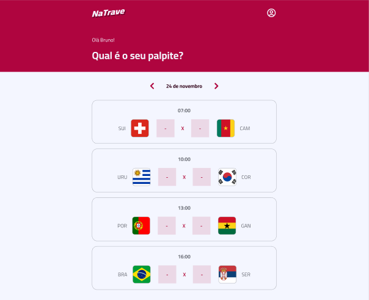

## 💻⚽ Full Stack Challenge

This project was developed during CodarMe Bootcamp Full Stack Challenge - World Cup Edition!. It was a week of practical content developing this Full Stack application.


<hr />

## 🖼 Imagens do Projeto (Web)

<p align="center">
  
</p>
<p align="center">
  
</p>

## 💾 How to install

```bash
  cd web
  npm install
  # or with yarn
  yarn install

  npm run dev
```

&nbsp;

## 🛠️ Technologies/Tools Used

- **Web**
  - React
  - Vite
  - Radix
  - Tailwind
  - date-fns
  - react-router-dom
- **Backend**
  - Node
  - Express

### 🔗 Online Project

- [Na Trave]()
- [Figma](https://www.figma.com/file/sHIUFoBfSOLs8JlqNqQuhS/Projeto-%E2%80%A2-Na-Trave)

&nbsp;

<p align="center">Made with ❤ by Fábio Filho</p>
